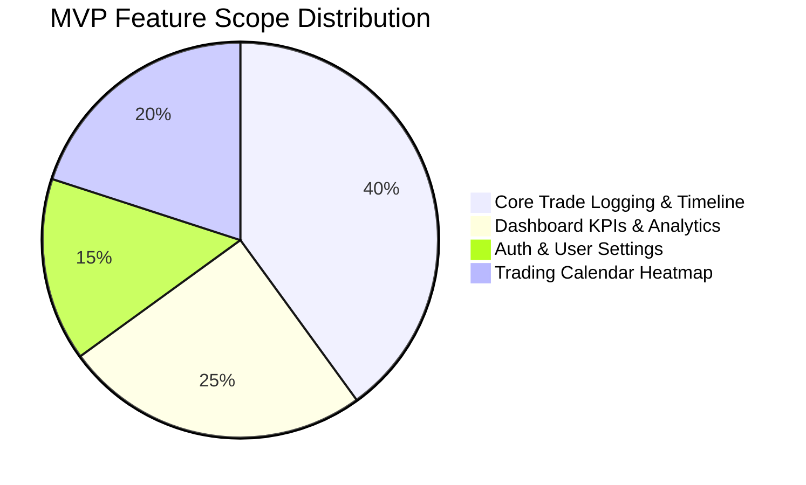
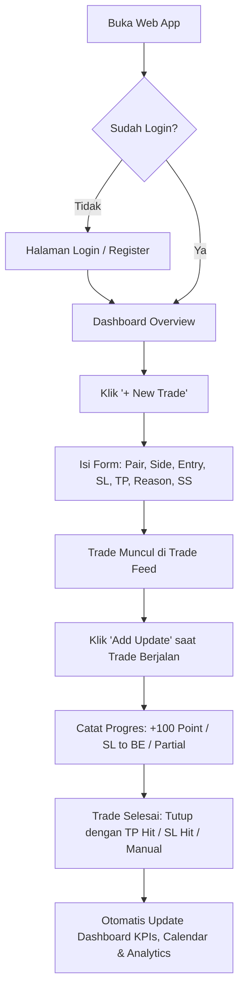
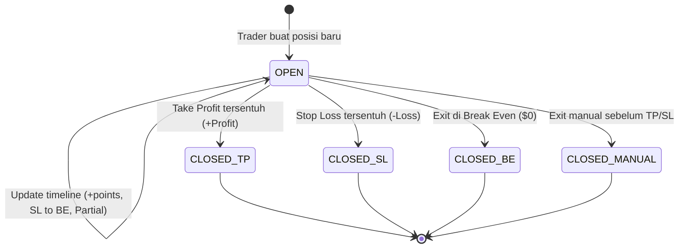
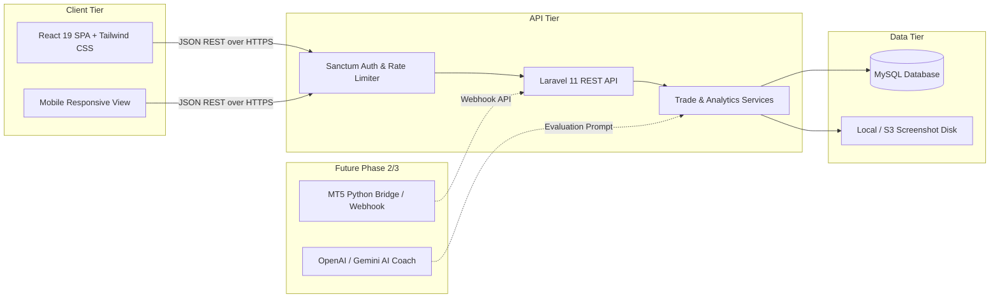

# Product Requirements Document (PRD)
# Trading Journal Pro — MVP v1.0 & Scalable Architecture

---

| **Document Information** | **Details** |
| :--- | :--- |
| **Product Name** | Trading Journal Pro |
| **Document Version** | 1.0 (MVP Definition & Phase 2/3 Roadmap) |
| **Target User Group** | Discretionary & Systematic Forex/XAUUSD Traders (Desktop & Mobile) |
| **Primary Stack** | Laravel 11 (REST API) + MySQL + React 19 + Tailwind CSS |
| **Status** | Ready for Sprint 0 / Development |
| **Author** | Product & Engineering Team |

---

## 1. Executive Summary & Product Vision

### 1.1 The Vision
**Trading Journal Pro** dirancang untuk menjadi *"Linear / Discord for Financial Traders"*. Platform ini bukan sekadar arsip statis untuk mencatat win/loss, melainkan sistem operasi harian bagi trader untuk **mencatat perjalanan posisi secara live (timeline update)**, mengidentifikasi kebocoran strategi (strategy leaks), dan menumbuhkan disiplin eksekusi melalui visualisasi data modern berestetika tinggi.

### 1.2 Masalah Utama Trader Discretionary (The Pain Points)
1. **Catatan Tercecer & Tidak Konsisten**: Kebanyakan trader mencatat di Excel/Google Sheets yang kaku, atau grup Telegram/Notion pribadi yang tidak memiliki metrik otomatis.
2. **Kehilangan Konteks Psikologis & Timeline Entry**: Saat trade berlangsung (running), trader sering panik atau overthinking. Tidak ada platform yang memfasilitasi log progres trade secara live seperti social media feed (misal: *Entry @ 09:15 -> +100 point @ 09:47 -> SL digeser ke BE -> TP Hit @ 10:15*).
3. **Statistik Manual & Lambat**: Menghitung Win Rate mingguan, Average Risk-to-Reward (RR), jam entry paling menguntungkan, dan pair terbaik memakan waktu berjam-jam bila dilakukan manual.
4. **Persiapan Otomasi Masa Depan**: Trader ingin jurnal yang hari ini bisa dipakai manual dengan sangat cepat, namun di kemudian hari siap menerima data otomatis dari broker (MetaTrader 5) dan evaluasi cerdas dari AI Trading Coach.

---

## 2. User Persona & Target Market

### Persona Utama: Raihan (Discretionary Scalper / Day Trader)
- **Instrumen Utama**: XAUUSD (Gold) & Major FX Pairs (EURUSD, GBPUSD).
- **Metodologi Analisis**: Smart Money Concepts (SMC - Break of Structure, Liquidity Sweep, FVG, Order Block) dikombinasikan dengan Key Support & Resistance (M5/M15 entry timeframe).
- **Platform Trading**: MetaTrader 5 (MT5 Desktop & Mobile).
- **Karakteristik & Perilaku**:
  - Melakukan 2–5 trade per hari.
  - Membutuhkan antarmuka yang cepat (< 30 detik untuk log entry baru).
  - Menyukai tampilan dark mode bergaya modern (*Raycast / Linear style*).
  - Ingin melihat review visual: screenshot chart sebelum entry dan sesudah exit.
- **Kebutuhan Kritis**:
  - Ingin melihat perkembangan trade secara real-time.
  - Ingin jurnal yang rapi seperti media sosial / chat feed, bukan spreadsheet kaku.

---

## 3. Product Scope & MoSCoW Prioritization



### 3.1 In-Scope (Phase 1 — MVP Wajib)
- [x] **Authentication & User Profile**: Registrasi, login, token-based session (Sanctum), pengaturan initial equity & currency.
- [x] **Trade Logging Engine**: Form input cepat untuk Pair, Side (BUY/SELL), Entry Price, Stop Loss, Take Profit, Lot Size, Timeframe, Session, Strategy/Reason, dan Upload Screenshot chart.
- [x] **Live Trade Feed (Social-Style Timeline)**: Tampilan kartu trade bergaya feed Discord/X dengan sub-timeline event (+50 pip, geser SL to BE, take partial, TP Hit, SL Hit).
- [x] **Quick Status & Progress Updates**: Modal popup untuk menambahkan update running price, floating P&L, catatan mental/emosi, dan status akhir trade.
- [x] **Executive Dashboard Widgets**: Total Trades, Win Rate %, Net Profit ($ / Point), Average RR, Daily P&L, dan Equity Curve.
- [x] **Trading Calendar Heatmap**: Tampilan kalender bulanan dengan badge warna hijau (net win day) dan merah (net loss day); klik tanggal untuk membuka riwayat hari tersebut.
- [x] **Statistik & Breakdown**: Analisis performa berdasarkan Jam Entry, Timeframe terbaik, Pair terbaik, dan Alasan Entry paling profitable.

### 3.2 Out-of-Scope (Direncanakan untuk Phase 2 & Phase 3)
- [ ] **Phase 2**: Auto-sync live price via WebSocket / broker quotation, auto-pip counter real-time, multi-screenshot gallery per trade, export report ke PDF/CSV.
- [ ] **Phase 3**: Integrasi bridge MetaTrader 5 (MT5 EA / Python socket sync), Telegram Bot alerts, AI Trading Coach (OpenAI/Gemini analysis untuk mengevaluasi disiplin SMC dan deteksi overtrading).

---

## 4. User Journey & Flowcharts

### 4.1 End-to-End User Flow


### 4.2 Lifecycle Status Trade


---

## 5. UI/UX Specifications & Wireframe Layouts

### 5.1 Design System Tokens
- **Theme**: Luxury High-Contrast Dark Mode
- **Palette**:
  - `Background`: `#0B0B0B` (Deep obsidian black)
  - `Surface / Card`: `#161616` (Refined dark charcoal)
  - `Border / Divider`: `#262626` (Subtle boundary)
  - `Accent Gold (XAUUSD)`: `#F5B942` (Primary brand accent)
  - `Success / Profit`: `#22C55E` (Vibrant emerald green)
  - `Danger / Loss`: `#EF4444` (Vibrant rose red)
  - `Text Primary`: `#FFFFFF`
  - `Text Secondary`: `#A1A1AA` (Muted zinc)
- **Typography**:
  - Primary UI Font: `Inter`, `-apple-system`, `sans-serif`
  - Financial Data / Monospace: `Geist Mono` / `JetBrains Mono`
- **Border Radius**:
  - Container / Card: `24px`
  - Inputs & Buttons: `14px`
  - Badges: `9999px` (Pill shape)

### 5.2 Halaman 1: Dashboard Overview
```
+-----------------------------------------------------------------------------------+
|  [Logo] TRADING JOURNAL PRO          [Live Time: 13:45 UTC]   [+ New Trade] (User)|
+-----------------------------------------------------------------------------------+
|                                                                                   |
|  [ Total Trades ]   [   Win Rate   ]   [ Net Profit ($) ]   [ Avg RR ]   [ Daily ]|
|  |     142      |   |    68.4%     |   |   +$12,450.00  |   | 1:2.4  |   | +$450 | |
|  +--------------+   +--------------+   +----------------+   +--------+   +-------+|
|                                                                                   |
|  +--------------------------------------------+  +--------------------------------+|
|  | Equity Growth Curve (Chart)                |  | Win/Loss & Session Breakdown   ||
|  | [Line Chart: Net PnL over last 30 days]    |  | - London: 72% WR (+$7,200)     ||
|  |                                            |  | - New York: 65% WR (+$5,250)   ||
|  +--------------------------------------------+  +--------------------------------+|
|                                                                                   |
|  +-------------------------------------------------------------------------------+|
|  | Recent Active Positions & Live Feed Snippet                                   ||
|  +-------------------------------------------------------------------------------+|
+-----------------------------------------------------------------------------------+
```

### 5.3 Halaman 2: Trade Feed (The Core Differentiator)
Tampilan feed interaktif bergaya Discord / X:

```
+-----------------------------------------------------------------------------------+
|  TRADE FEED                                              [Filter: All / Open / Closed] |
+-----------------------------------------------------------------------------------+
|                                                                                   |
|  +-----------------------------------------------------------------------------+  |
|  | [🟢 BUY XAUUSD]  Lot: 0.50  |  Entry: 3765.20  |  SL: 3760.00  |  TP: 3780.00|  |
|  | Timeframe: M5  |  Session: London Open  |  RR: 1:2.84                      |  |
|  | Reason: "M5 Liquidity Sweep at previous London Low + Bullish CHoCH + FVG"   |  |
|  | Screenshot: [Chart_Preview.png]                                             |  |
|  |                                                                             |  |
|  | TIMELINE UPDATES:                                                           |  |
|  | * 09:15 - Posisi dibuka di 3765.20                                          |  |
|  | * 09:47 - 🚀 Running +100 point (Price: 3766.20). Floating: +$50.00         |  |
|  | * 10:02 - 🛡️ Stop Loss digeser ke Break Even (3765.20). Risk eliminated.   |  |
|  | * 10:15 - 🎯 TAKE PROFIT HIT! +148 point | PnL: +$740.00                    |  |
|  |                                                                             |  |
|  | [ + Add Timeline Update ]   [ Edit Details ]   [ Close Position ]           |  |
|  +-----------------------------------------------------------------------------+  |
|                                                                                   |
+-----------------------------------------------------------------------------------+
```

---

## 6. Technical Architecture & Database Design

### 6.1 System Architecture Diagram


### 6.2 Relational Database Schema (DDL Specifications)

#### Table: `users`
| Field | Type | Attributes | Description |
| :--- | :--- | :--- | :--- |
| `id` | `BIGINT UNSIGNED` | PK, Auto Increment | User unique ID |
| `name` | `VARCHAR(100)` | NOT NULL | User full name |
| `email` | `VARCHAR(150)` | UNIQUE, NOT NULL | Login email address |
| `password` | `VARCHAR(255)` | NOT NULL | Bcrypt hashed password |
| `currency` | `VARCHAR(10)` | DEFAULT 'USD' | Base accounting currency |
| `initial_balance` | `DECIMAL(15,2)` | DEFAULT 10000.00 | Starting account balance |
| `current_balance` | `DECIMAL(15,2)` | DEFAULT 10000.00 | Dynamic current balance |
| `created_at` | `TIMESTAMP` | NULL | Created timestamp |
| `updated_at` | `TIMESTAMP` | NULL | Updated timestamp |

#### Table: `trades`
| Field | Type | Attributes | Description |
| :--- | :--- | :--- | :--- |
| `id` | `BIGINT UNSIGNED` | PK, Auto Increment | Trade unique ID |
| `user_id` | `BIGINT UNSIGNED` | FK -> `users.id` | Owner user ID |
| `pair` | `VARCHAR(20)` | NOT NULL | e.g. `XAUUSD`, `EURUSD` |
| `side` | `ENUM('BUY','SELL')`| NOT NULL | Order direction |
| `entry_price` | `DECIMAL(15,5)` | NOT NULL | Executed entry price |
| `sl_price` | `DECIMAL(15,5)` | NOT NULL | Stop Loss price |
| `tp_price` | `DECIMAL(15,5)` | NOT NULL | Take Profit price |
| `exit_price` | `DECIMAL(15,5)` | NULL | Actual exit price |
| `lot` | `DECIMAL(8,2)` | NOT NULL | Position size (e.g. 0.50) |
| `timeframe` | `VARCHAR(10)` | NOT NULL | e.g. `M1`, `M5`, `M15`, `H1` |
| `session` | `VARCHAR(30)` | NULL | `Asian`, `London`, `New York` |
| `reason` | `TEXT` | NULL | Analysis & entry justification |
| `status` | `ENUM(...)` | DEFAULT 'OPEN' | `OPEN`, `CLOSED_TP`, `CLOSED_SL`, `CLOSED_BE`, `CLOSED_MANUAL` |
| `profit_point` | `DECIMAL(12,2)` | DEFAULT 0.00 | P&L in points / pips |
| `profit_money` | `DECIMAL(15,2)` | DEFAULT 0.00 | Realized / floating P&L ($) |
| `rr_ratio` | `DECIMAL(6,2)` | DEFAULT 0.00 | Calculated Risk to Reward ratio |
| `screenshot_before`| `VARCHAR(255)` | NULL | Path to pre-trade chart image |
| `screenshot_after` | `VARCHAR(255)` | NULL | Path to post-trade chart image |
| `opened_at` | `DATETIME` | NOT NULL | Trade entry timestamp |
| `closed_at` | `DATETIME` | NULL | Trade exit timestamp |
| `created_at` | `TIMESTAMP` | NULL | Record created timestamp |
| `updated_at` | `TIMESTAMP` | NULL | Record updated timestamp |

#### Table: `trade_updates`
| Field | Type | Attributes | Description |
| :--- | :--- | :--- | :--- |
| `id` | `BIGINT UNSIGNED` | PK, Auto Increment | Update ID |
| `trade_id` | `BIGINT UNSIGNED` | FK -> `trades.id` (CASCADE)| Related trade |
| `update_type` | `ENUM(...)` | NOT NULL | `ENTRY`, `PROGRESS`, `SL_TO_BE`, `PARTIAL_TP`, `EXIT`, `NOTE` |
| `message` | `TEXT` | NOT NULL | Timeline text log |
| `current_price` | `DECIMAL(15,5)` | NULL | Price at moment of update |
| `floating_points`| `DECIMAL(12,2)` | NULL | Points in profit/loss |
| `floating_money` | `DECIMAL(15,2)` | NULL | Profit in currency |
| `screenshot_url` | `VARCHAR(255)` | NULL | Optional update screenshot |
| `created_at` | `TIMESTAMP` | NULL | Timestamp of update |

---

## 7. RESTful API Endpoints Specification

### 7.1 Authentication Module
- `POST /api/v1/auth/register`: Create user account and return Bearer token.
- `POST /api/v1/auth/login`: Authenticate email + password, return Bearer token.
- `GET  /api/v1/auth/me`: Get authenticated user profile & balance.
- `POST /api/v1/auth/logout`: Revoke active token.

### 7.2 Trades CRUD Module
- `GET    /api/v1/trades`: List trades (filters: status, pair, date range, page, limit).
- `POST   /api/v1/trades`: Create new trade log (supports multipart/form-data for screenshot).
- `GET    /api/v1/trades/{id}`: Detailed view of trade with complete timeline updates list.
- `PUT    /api/v1/trades/{id}`: Update trade parameters (edit SL, TP, notes).
- `PATCH  /api/v1/trades/{id}/close`: Close trade with exit price, status, and calculated profit.
- `DELETE /api/v1/trades/{id}`: Soft delete or permanent remove trade.

### 7.3 Trade Timeline Updates Module
- `POST   /api/v1/trades/{id}/updates`: Post new progress update (+100 point, SL to BE, note).
- `DELETE /api/v1/trades/{tradeId}/updates/{id}`: Remove a timeline item.

### 7.4 Analytics & Calendar Module
- `GET    /api/v1/analytics/overview`: High-level metrics (Win Rate, Total Trades, Profit Factor, Avg RR).
- `GET    /api/v1/analytics/charts`: Equity growth curve series and win/loss ratio chart.
- `GET    /api/v1/analytics/breakdown`: Performance grouped by session, timeframe, and entry reason.
- `GET    /api/v1/calendar`: Monthly calendar aggregate (daily count, net profit, win count).

---

## 8. Sprint Roadmap & Development Plan

### Sprint 0: Planning & Design System (Days 1–3)
- [x] Finalisasi PRD v1.0, Database ERD, dan spesifikasi API.
- [ ] Setup repository, folder structure (`backend/` & `frontend/`), dan design tokens Tailwind.
- [ ] Pembuatan aset UI standar (buttons, badges, dark card containers).

### Sprint 1: Backend API Foundation (Days 4–7)
- [ ] Inisialisasi Laravel 11 & konfigurasi MySQL database.
- [ ] Database migrations (`users`, `trades`, `trade_updates`, `tags`).
- [ ] Auth controller (Sanctum registration & login).
- [ ] Model relationships & TradeCalculationService (rumus otomatis point, profit, dan RR).
- [ ] CRUD API untuk Trades dan Timeline Updates.

### Sprint 2: Frontend Core & New Trade Form (Days 8–11)
- [ ] Inisialisasi React (Vite) + Tailwind CSS + Lucide Icons.
- [ ] Konfigurasi Axios API client dengan JWT/Sanctum bearer token interceptor.
- [ ] Halaman Login & Registrasi dengan feedback validasi instan.
- [ ] Komponen Modal `+ New Trade` dengan kalkulasi otomatis risk-to-reward dan upload screenshot.

### Sprint 3: Live Trade Feed & Timeline System (Days 12–15)
- [ ] Implementasi tampilan utama Trade Feed bergaya Discord/X cards.
- [ ] Komponen Sub-timeline interaktif per trade.
- [ ] Modal `+ Add Progress Update` (input running points, move SL to BE, upload update screenshot).
- [ ] Modal `Close Trade` dengan rekap profit point & uang.

### Sprint 4: Dashboard, Analytics & Calendar (Days 16–19)
- [ ] Widget KPI Dashboard (Total Trade, Win Rate, Net Profit, Equity, Avg RR).
- [ ] Grafik Equity Curve interaktif (Recharts / Chart.js).
- [ ] Halaman Kalender Trading bulanan dengan heatmap hijau/merah.
- [ ] Breakdown statistik per Session (London/NY) dan Timeframe (M5/M15).

### Sprint 5: Preparation for Phase 2 (MT5 & AI Architecture) (Days 20–24)
- [ ] Rancang Webhook endpoint `/api/v1/integrations/mt5` untuk menerima push data dari MT5 EA.
- [ ] Rancang format prompt LLM untuk modul AI Trading Coach (deteksi overtrading, review kedisiplinan SMC).
- [ ] End-to-end testing, optimasi query database, dan deployment preparation.

---

## 9. Future Killer Features Architecture (Phase 2 & 3)

### 9.1 AI Trading Coach Module
Modul ini bertindak sebagai mentor psikologi & strategi pribadi.
```
Input Trade Data:
- Pair: XAUUSD | Side: BUY | Entry: 3765.20 | SL: 3760.00 | TP: 3780.00
- Timeframe: M5 | Reason: "Support M5 + BOS" | Exit: CLOSED_TP (+148 pt)
- Screenshot Pre-Entry Image

Prompt Pipeline:
System prompt mengevaluasi eksekusi berdasarkan prinsip Smart Money Concepts (SMC):
1. Apakah entry berada di area discount/premium yang valid?
2. Apakah jarak SL logis terhadap liquidity sweep sebelumnya?
3. Apakah trader menaati plan (tidak memindahkan SL saat floating minus)?

Output AI Coach:
"Eksekusi Buy di area Support M5 sangat disiplin dan menghasilkan RR 1:2.8.
Catatan perbaikan: SL sebesar 52 point sedikit terlalu lebar untuk timeframe M5;
Anda bisa mempersempit SL tepat di bawah wick liquidity sweep untuk mendongkrak RR menjadi 1:4."
```

### 9.2 Real-Time MT5 Connector Architecture
- Script Expert Advisor (MQL5) atau background Python service menggunakan library `MetaTrader5` memantau event `OnTradeTransaction`.
- Begitu order BUY/SELL terbuka di MT5, script otomatis mengirimkan payload JSON ke API endpoint `/api/v1/integrations/mt5/open`.
- Setiap tick running profit melampaui milestone (+50 point, +100 point), event di-post ke `/api/v1/trades/{id}/updates` tanpa refresh halaman.

---

## 10. Acceptance Criteria (Definition of Done)
1. **Kecepatan Input**: Trader dapat mencatat trade baru dalam waktu kurang dari 30 detik.
2. **Kalkulasi Akurat**: Kalkulasi PnL, RR ratio, dan win rate 100% konsisten antara point dan nilai uang.
3. **Responsivitas**: Tampilan feed dan dashboard nyaman diakses di layar desktop (1920x1080) maupun mobile browser (iPhone / Android).
4. **Keandalan Data**: Semua update status trade tersimpan dalam timeline yang tidak dapat terhapus secara tidak sengaja.
